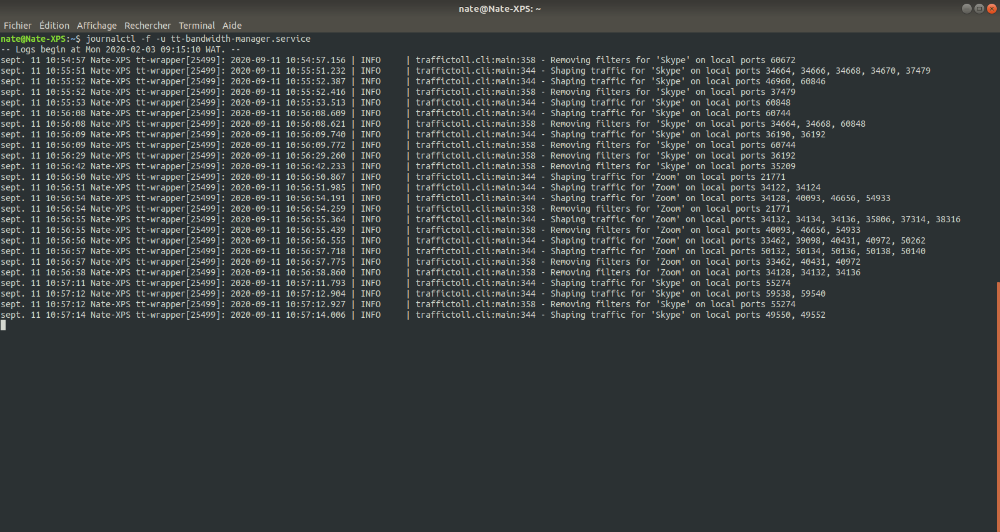

# Traffic Cop
This package installs **Traffic Cop** to help you manage bandwidth usage by app or process.


## Features
- Shows config (displayed in "B/s" regardless of unit used in the config file).
- Shows live upload and download rates globally and for each managed process.

## Limitations
Traffic Cop relies on **[nethogs](https://github.com/raboof/nethogs)** to track network usage. As of version 0.8.5-2, **nethogs** does not track UDP packets, which are used by many VoIP apps, including **Zoom** and **Skype**, and thus **Traffic Cop** also doesn't show reliable upload and download rates for UDP traffic. However, the backend app, **tt**, *does* properly manage this UDP traffic. You can confirm it for yourself if you have a pay-per-MB internet plan and check the counter provided by your ISP periodically during a call to verify that the rate you've set is being properly applied.

## More information
Traffic Cop manages bandwidth usage via a systemd service by:
- managing traffic over the device that is currently connected to the internet
- setting global download and upload bandwidth limits
- setting per-process bandwidth limits
- prioritizing processes

### Use cases
- Use the *bandwidth limits* if you pay for data by the MB; e.g. you don't want your audio or video calls to use more data than they absolutely need.
- Use *prioritization* if your available bandwidth is limited; e.g. you want to ensure that your audio calls go through, even if you're also downloading updates.

### Modifying the default bandwidth management configuration
The [default config](data/traffic-cop.yaml.default) limits several processes known to use a significant amount of bandwidth and gives some explanatory info on how to tailor it to your needs. It is found at [/usr/share/traffic-cop/traffic-cop.yaml](data/traffic-cop.yaml.default) and is copied to /etc/traffic-cop.yaml on first run if it doesn't already exist.
This config file requires elevated privileges to edit, e.g.:
```bash
$ sudo nano /etc/traffic-cop.yaml
```
This file is not overwritten during installation or update, so any changes you make are preserved.

### Starting and stopping traffic-cop.service
Once installed, Traffic Cop does not start managing bandwidth until you tell it to. It can be started by clicking the switch in the Traffic Cop window or with a terminal command. Once started it runs whenever there is a connection to the internet. You can also choose if you want it to start automatically every time the computer starts or not. The systemd service can be started and stopped with the usual systemd commands:
```bash
$ sudo systemctl restart traffic-cop.service # e.g., if you change the config file
$ sudo systemctl stop traffic-cop.service    # stop the service (restarts on reboot)
$ sudo systemctl disable traffic-cop.service # prevent it from starting on reboot
$ sudo systemctl enable traffic-cop.service  # allow it start on reboot
$ sudo systemctl start traffic-cop.service   # start the service immediately
```

### Viewing the log file
Runtime logging can be found as with all systemd services using:
```bash
$ systemctl status traffic-cop.service       # see if the service is running
$ journalctl -u traffic-cop.service          # full historical log
$ journalctl -f -u traffic-cop.service       # "follow" the log live
```


### Changing the network connection device
Normally, if you change your connection device (e.g. from Wi-Fi to Ethernet), **Traffic Cop** will recognize the change and adapt accordingly. This is known to *not* work as expected when the new connection is a newly-enabled wireguard VPN, and it may also be the case when turning on other VPNs.

If **Traffic Cop** shows that it is managing a network interface other than the current one, e.g. "wlp2s0" (Wi-Fi device interface) instead of "wgpia0" (wireguard VPN interface), please click the "Restart" button to update it. This may also be needed when the VPN is turned off, if the VPN's interface still exists.

## About
**Traffic Cop** is based on the [TrafficToll](https://github.com/cryzed/TrafficToll) python3 package developed by [cryzed](https://github.com/cryzed), but it's built as a debian package and modified to run as a systemd service.

It's composed of 4 parts:
- The traffictoll python3 package whose executable is installed at /usr/bin/tt.
- A config file installed at /etc/traffic-cop.yaml.
- A wrapper script installed at /usr/bin/tt-wrapper that:
  - selects the current networking device
  - starts the tt executable
  - monitors changes in the connection's status
- A service unit file called traffic-cop.service that configures systemd to manage the process.


*This app uses an icon based on the "traffic-police" icon created by [Freepik](https://www.flaticon.com/authors/freepik) and found at https://www.flaticon.com/.*
